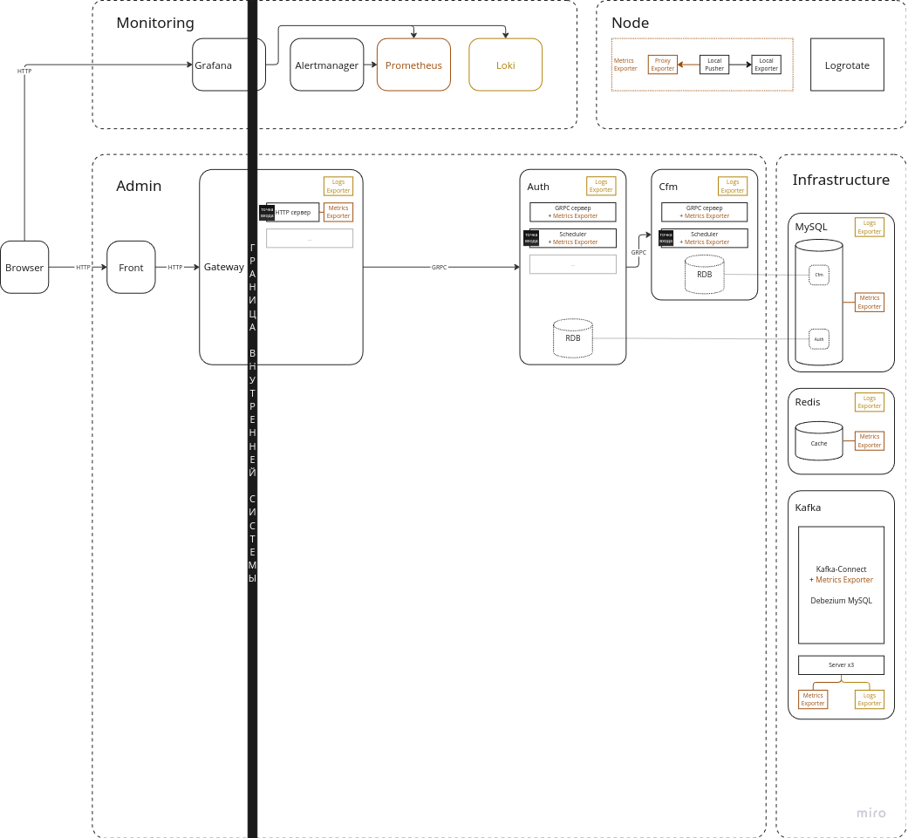
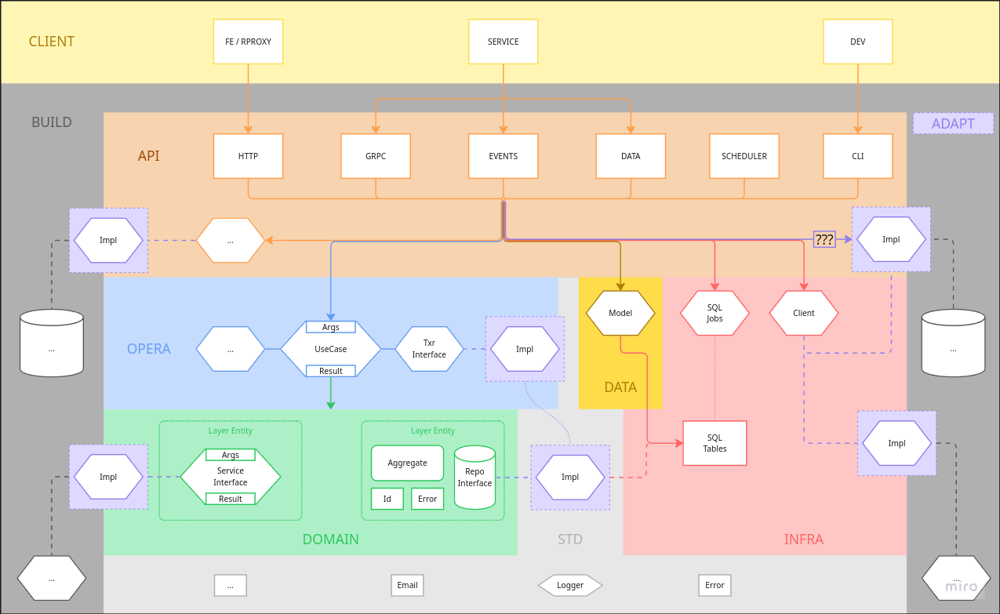

# Example

------------------------------------------------------------------------------------------------------------------------

## Общая структура

- [`admin`](admin) -- приложение-админка.
  - [`auth`](admin/auth) -- сервис авторизации.
  - [`cfm`](admin/cfm) -- сервис отправки OTP-кодов подтверждений.
  - [`front`](admin/front) -- см. [admin/front/README.md](admin/front/README.md).
  - [`gateway`](admin/gateway) -- api-шлюз для BE, точка входа.


- [`infrastructure`](infrastructure) -- инфраструктурные элементы, вынесенные отдельно для упрощения.
  - [`kafka`](infrastructure/kafka)
  - [`mysql`](infrastructure/mysql)
  - [`redis`](infrastructure/redis)


- [`monitoring`](monitoring) -- приложение для мониторинга системы.


- [`node`](node) -- обвязки физического сервера, на котором развернут проект.
  При физическом разделении компонентов эти обвязки были бы частью каждого отдельно развернутого компонента.


Схема:



------------------------------------------------------------------------------------------------------------------------

## Структура компонента

Структура компонента нижнего уровня:
```
|- app          -- код приложения, конфиги, ресурсы, ...
|- build        -- элементы сборки контейнеров (Dockerfile'ы, конфиги, ...).
|- state        -- состояние развернутого приложения, сохраняемое между запусками (логи, данные, ...).
```

### app

Структура основана на [Hexagonal Architecture](https://herbertograca.com/2017/11/16/explicit-architecture-01-ddd-hexagonal-onion-clean-cqrs-how-i-put-it-all-together/).

> Для некоторых компонентов (например, [`front`](admin/front), [`gateway`](admin/gateway), ... ) 
> такая организация может быть излишней -- однако, применяется намеренно однообразия ради.
> Спорный момент...

Используемые слои:

- <span style="padding: 0 1em; color: #1a1a1a; background: #b0b0b0">build</span> -- слой окружения и сборки.

- <span style="padding: 0 1em; color: #1a1a1a; background: #dedaff">adapt</span> --
  не является полноценным слоем, содержит secondary-adapter`ы.
  Выделен из классического слоя инфраструктуры для наглядности.

- <span style="padding: 0 1em; color: #1a1a1a; background: #f8d3af">api</span> --
  клиенты ядра приложения (например, http-сервер, планировщик, ...), primary-adapter`ы.

- <span style="padding: 0 1em; color: #1a1a1a; background: #c6dcff">opera</span> -- классический операционный слой.
- <span style="padding: 0 1em; color: #1a1a1a; background: #adf0c7">domain</span> -- классический доменный слой.

- <span style="padding: 0 1em; color: #1a1a1a; background: #ffdc4a">data</span> -- альтернатива комбинации
  <span style="padding: 0 1em; color: #1a1a1a; background: #c6dcff">opera</span> и
  <span style="padding: 0 1em; color: #1a1a1a; background: #adf0c7">domain</span>
  для случаев, ориентированных на прямую работу с данными.

- <span style="padding: 0 1em; color: #1a1a1a; background: #ffc6c6">infra</span> --
  классические инфраструктурные элементы, за исключением secondary-adapter`ов.

- <span style="padding: 0 1em; color: #1a1a1a; background: #e7e7e7">std</span> --
  утилитарный код, который можно рассматривать в рамках проекта как часть стандартной библиотеки языка.
  Например, тип данных Email, функции работы с массивами, ...


Направление зависимостей -- строго сверху вниз: 
вышележащий слой имеет доступ только к примыкающим снизу слоям (см. схему).

Исключением является <span style="padding: 0 1em; color: #1a1a1a; background: #e7e7e7">std</span>
и использование неизменяемых объектов из всех нижележащих слоев в качестве DTO для уменьшения количества трансформаций.

> TODO: ??? обращение к 
> <span style="padding: 0 1em; color: #1a1a1a; background: #dedaff">adapt</span>
> из
> <span style="padding: 0 1em; color: #1a1a1a; background: #f8d3af">api</span>
> --
> [gateway/session_closed](admin/gateway/app/internal/api/kafcon/bundles/admin_auth_events/actions/session_closed.go)

Доступ к смежным слоям выполняется через интерфейсы и адаптеры.

В зависимости от приложения те или иные слои могут отсутствовать.

<span style="padding: 0 1em; color: #1a1a1a; background: #fff6b6">client</span> не входит в приложение,
но изображен на схеме для наглядности.




### build

TODO

### state

TODO

------------------------------------------------------------------------------------------------------------------------

# Запуск

1. Копировать `.env.example` в `.env`, переопределить переменные при необходимости.

2. Выполнить
    ```
    . tools.sh up
    ```

------------------------------------------------------------------------------------------------------------------------

# Заметки

### Docker-compose и .env

Файлы не распределены по папкам компонентов (для пущей инкапсуляции),
поскольку могут использовать общие элементы (например, DEPLOY_... переменные окружения).
Также такой подход усложнил бы использование переменных окружения и запуск проекта
(например, при конфликте переменных API_KEY в файлах /cmp1/.env и /cmp2/.env).


### Сборщики логов и ротация.

Для экспорта логов в систему мониторинга используются `grafana-alloy`-контейнеры.
Для ротации логов на сервере используется `logrotate`.

При текущей конфигурации (alloy-экспортеры c интервалами сбора 5s и logrotate в режиме copy-truncate) возможна ситуация,
когда между сборами логов alloy-экспортером произойдет запись новых логов и ротация файла.
Тогда логи, записанные в промежуток между последним сбором и ротацией, не будут собраны, поскольку уже "архивированы".

Кроме того, logrotate с copy-truncate сам по себе может терять логи во время выполнения (см. в конфиге logrotate).

Включение "архивных" файлов в сбор и tail_from_end=false подберет пропущенные, но и продублирует все ранее собранные логи,
поскольку новый файл -- новый поток (как минимум метка "имя файла" изменится).

Простое и однозначное решение не было найдено, но вероятность промаха мала -- оставлено нерешенным.


### .proto-файлы

Генерация кода из `proto`-файлов [настроена](.dev/tools/go/Dockerfile) на пакет с именем `pb` -- для `api/grpc/pb`.
Поэтому в `infra/clients/{service}` пакет `pb` используется для удобства обновления клиента простым копированием файлов.
Выделять подобный код в общие пакеты в данном проекте излишне.

Сервис может содержать grpc-сервер и несколько grpc-клиентов для других сервисов.
Имена файлов, из которых сгенерен был grpc-код сервера и всех клиентов должны отличаться в пределах сервиса,
иначе возникнет ошибка `panic: proto: file ".proto" is already registered`.
Это значит, что, например, нельзя использовать файл с именем ".proto" для генерации сервера в сервисе auth
и использовать для реализации клиента скопированные файлы из сервиса cfm,
которые также были сгенерированы по файлу с именем ".proto" -- нужно использовать "auth.proto" и "cfm.proto".


### Node Metrics Exporter

См. [node/build/prometheus-exporter/README.md](node/build/prometheus-exporter/README.md).


### OpenApi

Используется по аналогии с `protobuf/grpc` для стандартизации и удобства использования структур запросов/ответов.

#### Разделение по бандлам

В `gateway` ендпоинты разделены по бандлам для простоты восприятия.
Каждый бандл, если в нем используется `openapi`, содержит свою спецификацию -- это накладывает некоторые ограничения:

- необходимо дублировать общие компоненты, которые требуются спецификациям нескольких бандлов:
  - папку `common` с общими элементами
  - `components.securitySchemes` из-за ограничений протокола и генератора (`allOf` и `$ref`).

- необходимо прописывать полный путь в урле внутри бандла, хотя напрашивается использование относительного.
  Технически это можно было бы сделать в точке инициализации роутера, передав префикс в BaseUrl-опции,
  однако в получаемой документации этот префикс не будет добавлен, что будет сбивать с толку.

#### Коды ответов

В спецификациях сокращено количество описываемых HTTP‑статусов до трёх базовых сценариев:
- `200` -- успешный ответ;
- `422` -- ожидаемые неуспешные сценарии (бизнес‑ошибки) с уточняющим полем `code` и текстовым сообщением `message`.
- `редиректы` (например, 307 Temporary Redirect).

Все прочие HTTP-коды в спецификации не описываются: они считаются внештатными ситуациями, багами и т.д.

Такой подход выбран для упрощения как спецификации, так и использования сгенерированного кода,
поскольку генератор создает отдельный тип (структуру) респонса для каждого описанного в спецификации кода ответа.


### Kafka

#### Ограничение на добавление партиций

Добавление партиций в существующий топик допустимо лишь в случаях, когда сохранение порядка сообщений не имеет значения.
Либо когда есть возможность предотвратить считывание одной группы сообщений из разных партиций
при попадании этой группы в партицию, отличающуюся от той, в которую группа отправлялась до добавления новой партиции.
В противном случае группа может разделиться на две партиции и быть обработанной непоследовательно.

Проще всего иметь изначальный запас партиций в топике.
Еще один относительно простой вариант -- замена топика на новый с увеличенным количеством партиций.
Есть и другие варианты решения проблемы, но на данный момент достаточно упоминания только этих двух.

#### Консьюмеры

В идеальной среде в каждом сервисе-приемнике использовалось бы несколько консьюмер-контейнеров на каждый топик.
В данном проекте для экономии ресурсов каждый сервис-приемник использует один консьюмер-контейнер на все топики,
однако, разделение по топикам для наглядности выполнено с помощью отдельных горутин-консьюмеров
(например, [gateway](admin/gateway/app/cmd/kafcon/consumer/main.go)).
Стоит упомянуть, что _kafka.Consumer_ может обрабатывать несколько топиков одним консьюмером, но это менее наглядно.

Количество запущенных горутин-консьюмеров имеет смысл делать равным количеству партиций в топике,
чтобы каждая партиция обрабатывалась независимо от других, как в случае с физически отдельными консьюмерами.
Однако, при этом следует помнить, что равномерность такого распределения искусственна,
и код обработчиков не должен на нее опираться.

Неудачные идеи:

- Реализация многопоточного консьюмера, в котором основной поток-читатель передавал бы сообщения потокам-обработчикам,
автоматически запускавшимся при ре-балансировке по одному на партицию,
в конечном итоге была отклонена из-за несоразмерности выигрыша прилагаемым усилиям.
Возможный выигрыш -- кроме примера _fan-out_-подобного кода для данного проекта --
гарантированная обработка каждой партиции в отдельном потоке, независимо от количества запущенных консьюмеров и партиций.
Это ускоряло бы обработку сообщений в случаях неравномерного (не 1 к 1) распределения партиций по консьюмерам.
Однако, потенциальное ускорение возможно лишь при равномерном заполнении обрабатываемых партиций -- в противном случае
из-за заполнения буферов потоков-обработчиков (например, при достаточно медленной обработке и/или перекосе в партициях)
такой консьюмер деградировал бы до стандартного однопоточного, блокируясь в ожидании передачи сообщений обработчикам.
Также используемый пакет [confluent-kafka-go](https://github.com/confluentinc/confluent-kafka-go/tree/v2.12.0) 
основан на C-коде и не обладает детальной документацией / тестами
(например, нет явной информации о том, какой метод в каких случаях возвращает какие ошибки),
что осложняет поиск и применение решений, связанных с деталями реализации _librdkafka_
(для той же буферизации потоков-обработчиков требуется информация о внутренних буферах, событии ре-балансировки и т.д.).

- Реализация параллельной обработки сообщений по группам из одной партиции еще более сложная
(например, какой оффсет нужно сохранить, если группа Б обработана раньше группы А, а обработка группы А провалилась?),
а проблема распараллеливания решается проще за счет увеличения кол-ва партиций и, соответственно, консьюмеров.

#### SDK

В зависимости от топологии обмена сообщениями сервисы предоставляют небольшие пакеты 
с высокоуровневым кодом клиента и/или интерфейсом обработчика по аналогии с генерируемыми на основе _Protobuf_ / _OpenApi_
(например, [kafapi](admin/auth/app/internal/api/kafprod/admin_auth_events/kafapi)).

По той же аналогии в _fan-out_-подобных топологиях в сервисах-приемниках обработчики для удобства разделены по бандлам,
где один бандл представляет топик 
(например, [admin_auth_events](admin/gateway/app/internal/api/kafcon/bundles/admin_auth_events)).

#### Гарантии доставки

Семантика доставки зависит от конкретного сервиса-потребителя / обработчика и топика,
и может быть реализована как на уровне консьюмера с помощью сохранение оффсета
(например, [gateway](admin/gateway/app/cmd/kafcon/consumer/main.go)),
так и на уровне конкретного обработчика при необходимости смешивания различных семантик в рамках одного консьюмера
(например, --- TODO ---).

**ВАЖНО**: В семантике `at-least-once` при передаче партиции в следствии ре-балансировки другому консьюмеру
может возникнуть ситуация **одновременной обработки сообщения несколькими консьюмерами**
(двумя или даже более при повторной ре-балансировке и, например, слишком медленной обработке сообщения),
поскольку новый консьюмер-владелец партиции не ждет подтверждения ее передачи от прежнего владельца 
и начнет обработку с последнего сохраненного оффсета в группе -- т.е. как минимум с текущего сообщения.

Кроме того, порядок обработки сообщений может быть нарушен, если новый консьюмер, которому была передана партиция,
выполнит (или проигнорирует, например, из-за дедупликации) обработку текущего сообщения и успеет обработать следующее
до того, как завершится обработка текущего сообщения в текущем консьюмере.

В данном проекте из-за ограничения на добавление партиций и использования одного консьюмер-контейнера на группу (см. выше)
ре-балансировка в следствии изменения состава консьюмер-группы исключена по умолчанию.
Однако, ре-балансировка может произойти также и при достаточно медленной обработке сообщений
в следствии превышения интервала _max.poll.interval.ms_, что делает проблему актуальной даже без необходимости в обобщении.

В общем случае можно попытаться решить проблему на уровне консьюмера изменением параметра _max.poll.interval.ms_
и _max.poll.records_, но такой подход приемлем только при хорошо предсказуемой скорости обработки сообщений.
Стоит учесть, что _max.poll.records_
[не поддерживается](https://github.com/confluentinc/librdkafka/blob/master/INTRODUCTION.md#supported-kips)
в _librdkafka_ для _Go_, а 
[_kafka.Poll()_](https://github.com/confluentinc/confluent-kafka-go/blob/v2.12.0/kafka/consumer.go#L450)
поставляет сообщения по одному -- соответственно, _max.poll.interval.ms_ определяет время обработки одного сообщения.

Можно попытаться ограничить работу обработчика с помощью отменяемого контекста,
указав timeout/deadline в соответствии с _max.poll.interval.ms_ и запасом времени на выполнение отмены операции,
иначе отмена операции может выполняться уже одновременно с "прямой" обработкой сообщения другим консьюмером.

Реализация отмены обработки сообщения в текущем консьюмере при изъятии партиции неприменима,
поскольку уведомление о ре-балансировке может быть получено уже после передачи партиции другому консьюмеру --
соответственно, и отмена операции может быть вызвана уже после начала обработки сообщения новым консьюмером,
а значит некоторое время оба консьюмера все же будут одновременно обрабатывать одну и ту же партицию,
не говоря уже о возможных последствиях одновременного исполнения, вероятно, конфликтующих сценариев обработки и отмены.

Таким образом, поскольку возникновение данной проблемы в первую очередь связано с конкретным обработчиком сообщений,
то и ответственность за ее решение должна лежать в первую очередь на самом обработчике, а не на консьюмере.


#### DLQ (Dead Letter Queue)

Использование DLQ зависит от конкретного сервиса-потребителя и топика,
но в общем случае DLQ может быть реализована на уровне бандла-топика, а не общего консьюмера,
поскольку способ извлечения необходимых метаданных сообщения зависит от способа их передачи сервисом-производителем,
который может иметь свои особенности и ограничения (например, формирование заголовков в Debezium-коннекторе).

Представленный механизм DLQ основывается на базовом принципе работы _Kafka_ -- группах сообщений:
при попадании одного сообщения в DLQ все последующие сообщения той же группы автоматически направляются в DLQ --
это позволяет сохранить порядок сообщений в группе после устранения причины попадания группы в DLQ.
Если же сохранение порядка не требуется, то идентификаторы групп уже должны быть уникальными для каждого сообщения.

Если метаданные сообщения некорректны, или их не удалось извлечь, в DLQ перенаправляются все сообщения топика,
иначе будет нарушен порядок обработки сообщений одной из групп.
Это может быть накладно, но остановка консьюмера не позволит исправить данные перед повторной обработкой,
а при достаточно малом retention топика сообщения могут быть потеряны до устранения причины их попадания в DLQ.
Также в общем случае при несоблюдении ранее описанных правил добавления партиций
сообщения из неизвестной группы могут начать отправляться в новую партицию при ее добавлении,
поэтому для соблюдения порядка полученных сообщений перенаправление должно быть на уровне топика, а не партиции.

Обработка сообщений после устранения причины их попадания в DLQ должна начинаться с известных групп,
поскольку, исходя из вышеописанной логики, эти сообщения были получены до появления сообщения с нечитаемыми метаданными
и, соответственно, перенаправления всего топика в DLQ.

Если скорость обработки сообщений из DLQ меньше, чем скорость их поступления в DLQ,
следует остановить консьюмер до обработки всех сообщений необходимой группы (или всего топика).
Программная блокировка в консьюмер-группе на время обработки сообщений из DLQ неприменима,
поскольку вероятнее всего приведет к истечению _max.poll.interval.ms_ и, соответственно, повторяющейся ре-балансировке.
Вариант с установкой консьюмеров на паузу возможен, но неоправданно сложен по сравнению с ручной остановкой.

**ВАЖНО**: Остановка консьюмер-группы обязательна перед запуском DLQ-обработки 
при использовании несогласованной реализации хранилища сообщений и маркеров отравленных групп
(см. [dlq/storage.go](admin/gateway/app/internal/api/kafcon/components/dlq/storage.go)).

Наиболее простым и универсальным способом возвращения группы сообщений из DLQ в нормальное русло
является переотправка исправленных сообщений этой группы:
- до повторной отправки сообщений необходимо идентифицировать либо первое сообщение группы в DLQ,
  либо последнее успешно обработанное сообщение группы для определения начала испорченного диапазона сообщений
- после исправления сообщений на стороне производителя и их повторной отправки с начала испорченного диапазона 
  нужно дождаться появления в DLQ первого сообщения исправленного диапазона
- после этого все сообщения в DLQ по этой группе до первого исправленного сообщения нужно удалить
  и запустить DLQ-обработчик (предварительно остановив консьюмер-группу при необходимости).

Но такой подход подразумевает, что все читатели топика умеют корректно обрабатывать дубликаты.

#### Повторная обработка сообщений

Реализация повторной обработки сообщения при возникновении ошибки должна быть реализована на уровне бандла-топика
или даже обработчика конкретного типа сообщения.
Кроме того, на один запрос _librdkafka_ получает пачку сообщений от брокера и выдает их по одному из внутренней очереди,
поэтому, даже если не сохранить оффсет, повторное чтение возвращает следующее сообщение, а не текущее.

#### Debezium

См. [init_admin_auth_events_producer.py](infrastructure/kafka/build/connect/init_admin_auth_events_producer.py)

------------------------------------------------------------------------------------------------------------------------
